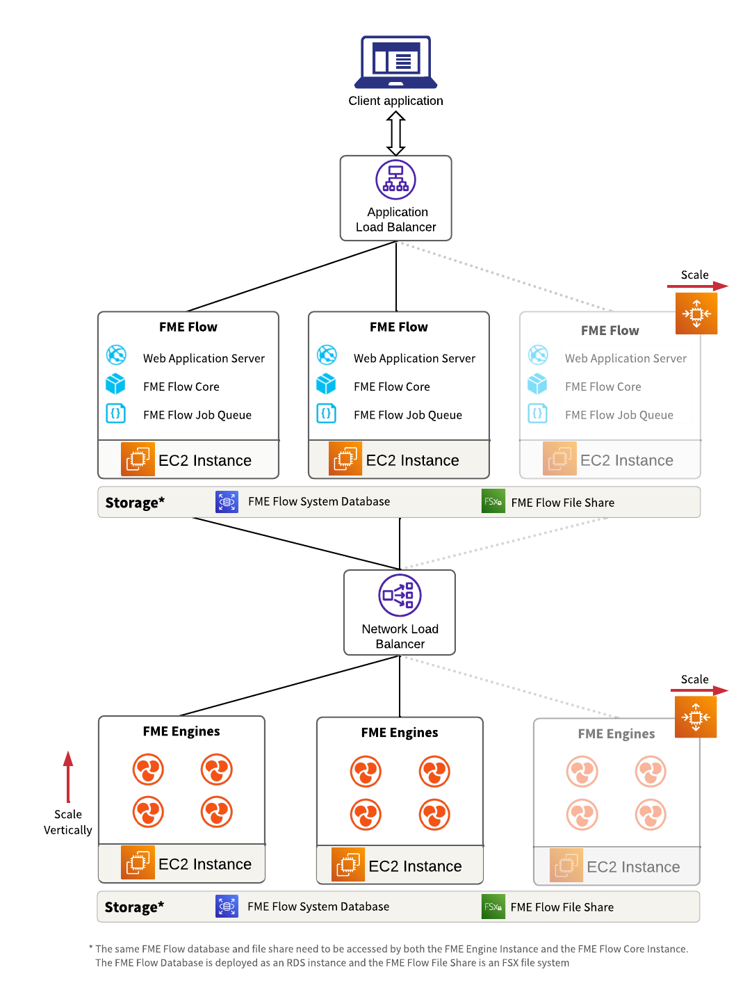

# FME Flow (Distributed deployment, Windows)
This CloudFormation templates create all necessary resources for a distributed FME Sever deployment using public AMIs for the core and engine ec2 instances.
# How to use the scripts
## Quickstart
### Prerequisites

### Create FME Flow Images
[Create FME AMIs with Packer](https://github.com/safesoftware/fme-server-iac-templates/tree/main/AWS/packer)

#### AWS Console
 To deploy FME Flow (Distributed deployment, Windows) on AWS from a local machine, you need access to an AWS Account via the console with sufficient permissions to deploy the services included in the template file. Follow this documentation depending on your scenario: [Cloudformation: Get Started](https://docs.aws.amazon.com/AWSCloudFormation/latest/UserGuide/GettingStarted.Walkthrough.html)

#### AWS CLI
An alternative way to deploy the template is using the AWS CLI. To install and setup the AWS CLI follow this [documentation](https://docs.aws.amazon.com/cli/latest/userguide/cli-chap-getting-started.html).

 ## Specify AMIs
 The AMIs used for the deployment are specified in a mapping that picks the relevant AMIs according to the region of the deployment. Before deploying the cloudformation template make sure that FME AMIs you created previously are specified in the Mappings section of the template, and the same region is specified that the AMIs were created in.

## Apply the deployment
 A good tool to review changes before they are applied are Cloudformation change sets. While this is primarily recommended for updates that are applied to an existing stack this is a great tool review and get familiar with the services that are created from a cloudformation template. When [Creating a stack on the AWS CloudFormation console](https://docs.aws.amazon.com/AWSCloudFormation/latest/UserGuide/cfn-console-create-stack.html) you will have the option to either create the stack or a change set for reviewing the services. For more information regarding change set review this documentation: [Updating stacks using change sets](https://docs.aws.amazon.com/AWSCloudFormation/latest/UserGuide/using-cfn-updating-stacks-changesets.html). To create a stack or a change set with the AWS CLI follow this [User guide](https://docs.aws.amazon.com/AWSCloudFormation/latest/UserGuide/cfn-using-cli.html) and review the [AWS CLI Command Reference](https://docs.aws.amazon.com/cli/latest/reference/cloudformation/index.html#cli-aws-cloudformation)

 See below for a example command for deploying the template via the AWS CLI: 
 ```
 aws cloudformation create-stack \
 --stack-name FMEFlowStack \
 --capabilities CAPABILITY_NAMED_IAM \
 --template-body file://template.yaml \
 --tags Key=Owner,Value=Owner \
 --parameters ParameterKey=ParameterKey=PublicAccess,ParameterValue=0.0.0.0/0 ParameterKey=Owner,ParameterValue=Owner
 ```

## AWS Secrets
With cloudformation AWS Secrets can be autogenerated. In this template the password for the Active Directory Admin account and the RDS password is autogenerated and retrieved from AWS Secrets during instance startup. To connect to the instance via RDP it is recommended to launch a Windows ec2 instance in a public network of the deployment and to allow RDP access in the FME Flow Security Group. The FME Core and FME Engine instances can then be accessed via RDP from the new ec2 instance via their private IPs using the Active Directory admin account as login.

## Architecture Diagram
See below for an architecture diagram of the deployment in AWS. There are some details not shown on the diagram, such as the VPC, subnets and secrets. This diagram also shows only one scaling group for FME Engines, though the deployment actually has two separate scaling groups for engines: One for standard engines and one for CPU engines. Otherwise those scaling groups are identical.


 # To do
 - create separate NSGs for RDS and FSX