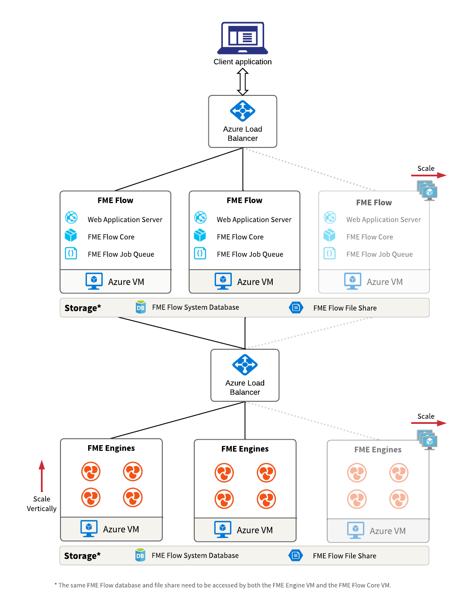

# FME Flow (Distributed deployment, Windows)
These Bicep scripts deploy [FME Flow (Distributed deployment, Windows)](https://azuremarketplace.microsoft.com/en-US/marketplace/apps/safesoftwareinc.fme-server-distributed-deployment?tab=overview) in your Azure Subscription. The scripts can be used as a boilerplate for automatic deployments of the public FME Flow Azure VM images in your own environment with your own configurations.
# How to use the scripts
## Quickstart
### Prerequisites
To deploy FME Flow (Distributed deployment, Windows) on Microsoft Azure from a local machine, the Azure CLI and Bicep need to be installed. Follow this documentation depending on your scenario: [Install Bicep tools](https://docs.microsoft.com/en-us/azure/azure-resource-manager/bicep/install)
### Apply the deployment
Once all prerequisites are installed you confirmed the Bicep scripts can be deployed via the following steps
1. Create a resource group in your Azure subscription for the deployment in your preferred location: ```az group create -l <location> -n <resource-group-name>```
2. Review the parameters. Most of the parameters have default values assigned, but can be changed in the `main.bicep` file. You will be prompted for any variable that does not have a default value.
3. Run ```az deployment group create --resource-group <resource-group-name> --template-file main.bicep``` from the directory that that holds the `main.bicep` file and provide any variables you are prompted for. This will take at least 10 - 20 minutes.
### Test FME Flow
Once the deployment is complete it is time to test FME Flow. The public URL for the new FME Flow can be found in the overview of the Application Gateway resource. Follow these steps to test FME Flow:
1. [Log on to the Web User Interface](https://docs.safe.com/fme/html/FME_Server_Documentation/AdminGuide/Log-on-Get-Started-2-Tier.htm)
2. [Request and Install a License](https://docs.safe.com/fme/html/FME_Server_Documentation/AdminGuide/Request_and_Install_a_License-2-Tier.htm)
3. [Run Workspace](https://docs.safe.com/fme/html/FME_Server_Documentation/WebUI/Run-Workspace.htm?)
### Delete the deployment
To delete the FME Flow deployment remove the resource group: ```az group delete -n <resource-group-name>``` 
## Parameters
|Parameter|Description|Default|
|---|---|---|
|`ownerValue`|Value for owner tag.||
|`location`|Location for the resources.||
|`vmSizeCore`|Size of VMs in the Core VM Scale Set.|'Standard_D2s_v3'|
|`vmSizeEngine`|Size of VMs in the Engine VM Scale Set.|'Standard_D2s_v3'|
|`vmssNameCore`|Name of the VM Scale Set for the Core machines|'fmeflow-core'|
|`vmssNameEngine`|Name of the VM Scale Set for the Engine machines|'fmeflow-engine'|
|`instanceCountCore`|'Number of Core VM instances.|1|
|`instanceCountEngine`|Number of Engine VM instances.|1|
|`storageAccountName`|Name of the storage account|'fmeflow{uniqueString}'|
|`storageAccountResourceGroup`|Name of the resource group for the existing virtual network||
|`postgresServerName`|Name of the Postgresql server|'fmeflow-postgresql-{uniqueString}'|
|`virtualNetworkName`|Name of the virtual network|'fmeflow-vnet'|
|`addressPrefixes`|Address prefix of the virtual network|'10.0.0.0/16'|
|`subnetName`|Name of the subnet|'default'|
|`subnetPrefix`|Subnet prefix of the virtual network|'10.0.0.0/24'|
|`subnetAGName`|Name of the subnet for the Application Gateway|'AGSubnet'|
|`subnetAGPrefix`|Subnet prefix of the Application Gateway subnet|'10.0.1.0/24'|
|`virtualNetworkResourceGroup`|Name of the resource group for the existing virtual network||
|`publicIpNewOrExisting`|Determines whether or not a new public ip should be provisioned.|'new'|
|`publicIpName`|Name of the public ip address|'fmeflow-pip'|
|`publicIpDns`|DNS of the public ip address for the VM|'fmeflow-{uniqueString}'|
|`applicationGatewayName`|Name of the resource group for the existing virtual network|'fmeflow-appgateway'|
|`engineRegistrationLoadBalancerName`|Name of the resource group for the existing virtual network'|'fmeflow-engineregistration'|
|`adminUsername`|Admin username on all VMs.||
|`adminPassword`|Admin password on all VMs.||
## Architecture Diagram
See below for an architecture diagram of the deployment in Azure. There are some details not shown on the diagram, such as the virtual networks and secrets. This diagram also shows only one scaling group for FME Engines, though the deployment actually has two separate scaling groups for engines: One for standard engines and one for CPU engines. Otherwise those scaling groups are identical.

# Todo
- create NSGs
- (optional) create NAT gateway for explicit outbound traffic of VMs: [Default outbound access in Azure](https://learn.microsoft.com/en-us/azure/virtual-network/ip-services/default-outbound-access)
- document how to use existing resources