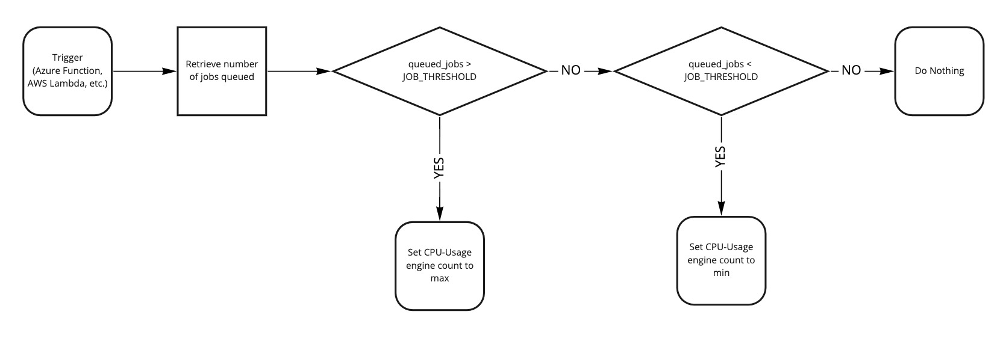

# Examples for scaling CPU-Usage (Dynamic) FME Flow Engines
The scaling examples showcase a proof of concept to scale CPU-Usage (Dynamic) FME Flow Engines based on queued jobs in Azure and AWS with python. These examples can be a starting point for an [Azure Function](https://learn.microsoft.com/en-us/azure/azure-functions/functions-overview) and [AWS Lambda](https://aws.amazon.com/lambda/) implementation supporting different scaling scenarios.

## How to use the scripts
The scripts depend on modules specified in the docstrings of each script. Additionally environment variables need to be set to authenticate with FME Flow and the respective cloud service provider. An easy way run these examples is to use a schedule as trigger using the interval that is best suited for the scaling scenario. For instruction regarding Azure Functions, review this doc: [Create a function in the Azure portal that runs on a schedule](https://learn.microsoft.com/en-us/azure/azure-functions/functions-create-scheduled-function). The run an AWS Lambda function on a schedule follow this tutorial: [Tutorial: Schedule AWS Lambda Functions Using CloudWatch Events] (https://docs.aws.amazon.com/AmazonCloudWatch/latest/events/RunLambdaSchedule.html)  

### Scaling engine hosts  with AWS Auto Scaling Group (scaleAwsAsg.py) or Azure Virtual Machine Scale Sets (scaleAzureVmss.py)
The scripts for scaling multiple hosts follow these steps:

This example shows potential methods that can be used to scale AWS ASG or Azure VMSS using the scale-in protection feature ([AWS](https://docs.aws.amazon.com/autoscaling/ec2/userguide/ec2-auto-scaling-instance-protection.html)/[Azure](https://learn.microsoft.com/en-us/azure/virtual-machine-scale-sets/virtual-machine-scale-sets-instance-protection)). The metric to scale in and out is a specified queued job threshold. If the queued job threshold is execeeded and additional instance is launched to provide an additional FME Engine. If To identify instances to protect, the engine hosts running jobs are queried via the FME Flow REST API.  

#### Job submission to engine shutting down
While the scale-in protection functionality of AWS ASG and Azure VMSS prevent the cancellation of jobs actively running it does not guard against jobs being submitted to engines that are in the middle of shutting down. This might be a rare scenario and depending on the use case this might not be an concern. One way to guard against this is to activate failed resubmission of failed jobs in FME Flow. This way any job that might be canceled, because it was accidentally submitted to a host hat is shutting down, the job will be added to the queue again to be processed by a different engine.

### Scale CPU-Usage engines with on a single existing FME Flow Engine host (scaleCpuUsageEngines.py)
This example it only utilizing the FME Flow REST API and scale CPU-Usage engines either up to a specified maximum value or down to a minimum value. The metric to scale in and out is an specified queued job threshold.

